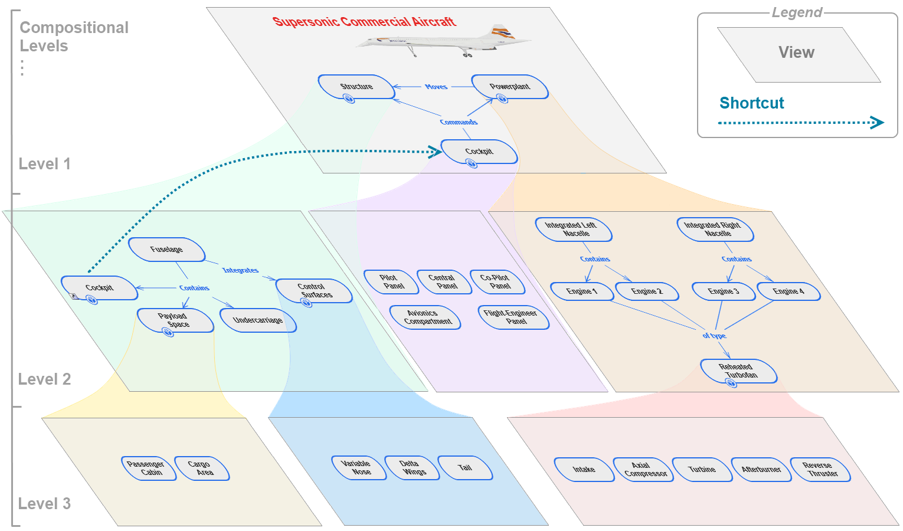

# Overview

ThinkComposer is a visual thinking tool for understanding problems, designing solutions, and expressing knowledge. It helps users create concept maps, mind maps, models, diagrams, and structured visual documents with detailed content attached to the visual elements.

This manual documents the independently maintained `tbm0115/ThinkComposer` fork while preserving the original ThinkComposer product model, terminology, and attribution.

The product is intended for professionals, academic users, students, analysts, designers, managers, and teams who need graphic means to explore, organize, and communicate knowledge. It is especially useful when the work involves discovery, problem analysis, solution design, research, process modeling, or knowledge transfer.

## Vision

ThinkComposer combines visual mapping with a typed information model. A user can start with a free-form diagram, then progressively add meaning through domains, definitions, details, markers, relationships, and generated outputs.

The guiding ideas are:

- Visual thinking should stay expressive enough for early exploration.
- Models should become precise when precision matters.
- Diagrams should support details, attachments, data tables, and generated files, not just shapes and lines.
- Domain definitions should let different fields use their own concepts, relationship types, markers, formats, and tables.
- Generated output should be derived from the model through templates instead of being manually recreated.

## Product Context

ThinkComposer sits between ordinary diagramming, mind mapping, modeling, and documentation tools.

It can be used for:

- conceptual maps and mind maps
- business and system diagrams
- analysis and design models
- domain-specific notation
- knowledge bases with attached details
- structured reports
- code or text generation from model data
- JSON-backed native persistence and JSON-assisted interchange with external tools and AI workflows

The application remains a native Windows desktop tool built with Windows Presentation Foundation. Modern `.tcom` and `.tdom` files are package containers whose authoritative saved payloads are JSON. The explicit JSON import/export commands remain editable exchange workflows layered on top of normal Open/Save.

## How ThinkComposer Thinks About Work

ThinkComposer separates user work into two main document types:

- A **Composition** contains knowledge about a specific subject, project, system, process, or area of work.
- A **Domain** defines the concepts, relationships, tables, markers, visual formats, and output templates available to compositions in a field.

Multiple compositions can use the same domain. A composition also carries an embedded domain snapshot so it can remain self-contained.

## Working Style

A typical workflow is:

1. Create or open a composition.
2. Choose a domain that fits the work.
3. Add concepts and relationships to a diagram view.
4. Attach details, tables, links, images, notes, or markers where needed.
5. Use layout and appearance tools to make the view readable.
6. Export reports, images, PDF, JSON, or generated text files.
7. Update the domain or composition through JSON when structured external editing is useful.

The rest of this manual explains each layer in that workflow, from the base model to current import/export and generation features.
