# Base Model

ThinkComposer's base model is the vocabulary shared by every composition and domain. It explains what the user creates, how visual objects represent meaning, and how domains constrain or enrich that meaning.

## Working Documents

ThinkComposer uses two main document types.

| Document | File type | Purpose |
|---|---:|---|
| Composition | `.tcom` | A self-contained knowledge document containing ideas, views, details, visuals, and an embedded domain snapshot. |
| Domain | `.tdom` | A reusable definition package containing concept types, relationship types, marker definitions, table structures, formats, base content, and output templates. |

A composition can be based on an external domain, but the composition file also stores enough domain information to remain portable.

## Common Object Properties

Most user-visible model objects share these properties:

| Property | Meaning |
|---|---|
| `Name` | Human-readable title. |
| `TechName` | Stable technical identifier, suitable for generated output and matching. |
| `Summary` | Short descriptive text. |
| `Description` | Richer explanatory text. JSON interchange exports this as plain text. |
| `TechSpec` | Technical specification text, often used by templates, code generation, or AI-assisted workflows. |
| `Version` | Optional version metadata such as creator, dates, annotation, and version number. |

Use `Name` for people and `TechName` for tools. A good `TechName` is stable, unique in its context, and free of display-only wording.

## Compositions

A composition is the user's main working document. It owns the root idea, the available views, the active view, model content, visual representations, details, and embedded domain.

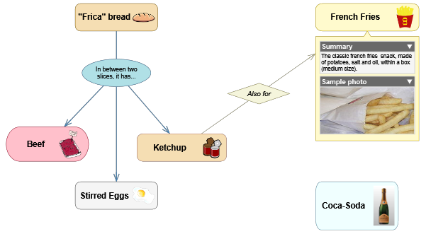

The root composition can contain nested ideas. Concepts can themselves be composite, giving a composition multiple levels of detail and multiple diagram views.

## Views

A view is a diagram canvas showing the composite content of a composition or idea. The same idea can appear in more than one view through visual representations or shortcuts.

Views store display-related settings such as:

- background
- grid size and snap-to-grid
- page display scale
- visible labels and indicators
- concept and relationship symbols
- complements such as notes, callouts, legends, and group regions

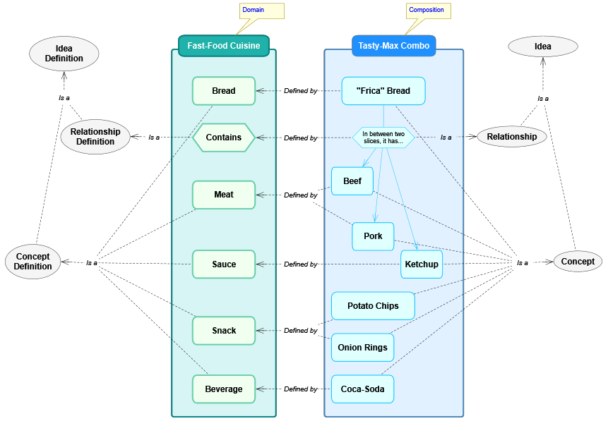

## Ideas

An idea is the base semantic item in a composition. There are two main kinds:

- **Concepts** are objects, actors, states, activities, data entities, or other things being described.
- **Relationships** connect concepts through roles and give those links meaning.

Ideas can carry details, custom fields, markers, version information, and visual representations. An idea can also be composite, meaning it contains child ideas and one or more views.

## Symbols And Visual Representations

A symbol is the visible body of a concept or the central symbol of a relationship. A visual representation groups the symbol and related visual elements that show an idea in a view.

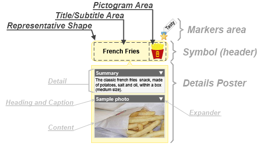

Symbols can show:

- title and subtitle text
- pictograms
- markers
- a details poster
- composite content as a mini-view
- connectors for relationships

Visual representations are separate from semantic ideas. This is why the same idea can have a primary visual in one view and a shortcut visual somewhere else.

## Shortcuts

A shortcut is a visual representation of an existing idea. It is not a duplicate concept or relationship. Use shortcuts when one semantic idea needs to appear in another location or context.

Current JSON interchange preserves shortcuts with `isShortcut: true`, so round-tripping does not accidentally duplicate semantic ideas.

## Details

Details attach rich content to ideas. They let a diagram element carry structured and unstructured information without crowding the diagram itself.

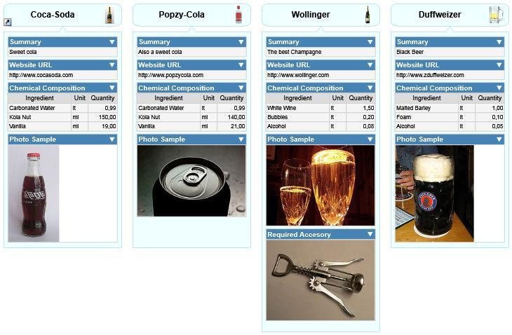

Supported detail kinds include:

- attachments
- resource links
- internal links
- tables
- custom fields
- text-like details such as descriptions and technical specifications

## Attachments And Links

Attachments embed content obtained from an external source, such as an image or data file. Resource links reference external resources such as files, folders, or web addresses. Internal links reference properties or related internal objects.

Attachments and links remain native `.tcom` content. JSON interchange exports safe metadata and text where supported, but it does not inline large binary payloads.

## Tables And Custom Fields

Tables store structured records inside ideas or domains. A table definition declares fields, label fields, required fields, contained-table fields, and display behavior.

Custom fields are table-record values attached to a specific idea. Output templates can access them through the `_` alias, for example:

```liquid
Also known as: {{ _['Alias'] }}
```

## Concepts

A concept is a concrete idea. Its behavior and visual defaults come from a Concept Definition in the active domain.

Concepts may be:

- atomic or composite
- versionable
- decorated with markers
- visually represented by different symbol formats
- assigned custom fields and details
- related to other concepts through relationships

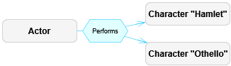

## Relationships

A relationship is an idea that links other ideas through role-based links. A relationship may have a central symbol and visible connectors, or it may hide its central symbol when the relationship is simple.

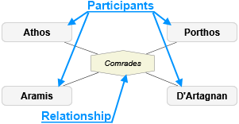

Relationships support:

- directional or non-directional semantics
- origin/source and target/destination roles
- participant roles for non-directional relationships
- link role variants such as multiplicity/cardinality
- optional link descriptors
- custom visual connector formats

## Connectors And Link Roles

Connectors are the visual lines between symbols. A connector represents a `RoleBasedLink`, which joins a relationship to an associated idea through a Link Role Definition.

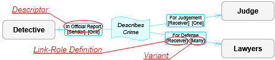

Link role definitions can constrain:

- which idea definitions are linkable
- maximum number of connections
- whether related ideas are ordered
- which role variants are allowed
- plug styles and connector appearance

## Markers

Markers are small visual annotations assigned to ideas. A marker can also have an optional descriptor. They are useful for priority, status, ownership, review state, classification, or any domain-specific tagging.

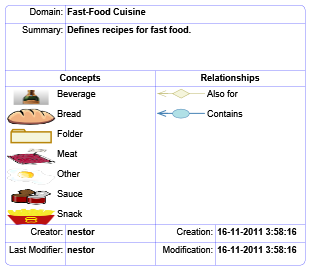

## Complements

Complements are visual objects attached to the view or to symbols. They enrich diagrams without becoming semantic concepts or relationships.

| Complement | Purpose |
|---|---|
| Legend | Explains visual conventions used in the view. |
| Info-Card | Displays selected object metadata. |
| Image | Adds a visual image to the diagram. |
| Text | Adds independent text. |
| Stamp | Adds status-like visual text. |
| Note | Adds explanatory annotation. |
| Callout | Adds a note with a pointer to a symbol. |
| Quote | Adds a callout styled as quoted text. |
| Group Region | Adds a background grouping boundary attached to a target idea. |
| Group Line | Adds a line-like grouping/lifeline complement. |

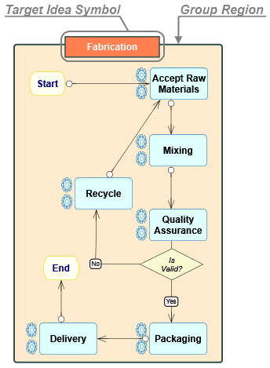

## Domains

A domain defines the meaning and visual language available to compositions. It is the metamodel for a business area, discipline, or notation.

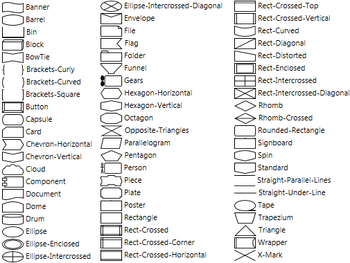

A domain may define:

- concept definitions
- relationship definitions
- link role definitions
- marker definitions
- table structures
- base tables
- external languages
- brushes and text formats
- symbol and connector formats
- detail designators
- output templates

## Idea Definitions

Idea Definitions are shared ancestors for Concept Definitions and Relationship Definitions. They declare the structural, visual, and information features of ideas created from them.

Important definition settings include:

- whether ideas are composable
- whether ideas are versionable
- allowed composite-content domain
- custom fields table definition
- detail designators
- visual symbol shape and format
- automatic creation behavior
- grouping behavior through Group Regions or Group Lines

## Brushes, Text Formats, And Symbol Formats

Domains define reusable appearance pieces so diagrams remain consistent.

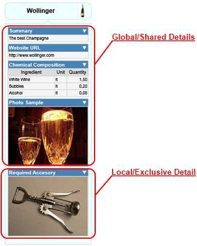

Brushes control fills and strokes. Text formats control title, subtitle, detail heading, content, and caption text. Symbol formats combine shapes, placement, pictograms, title areas, details posters, background brushes, line brushes, and flip/tilt behavior.

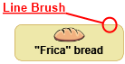

## Detail Definitions

A detail designator declares which detail kind an idea or definition may contain. Detail definitions can attach tables, attachments, links, and custom detail content to ideas in a controlled way.

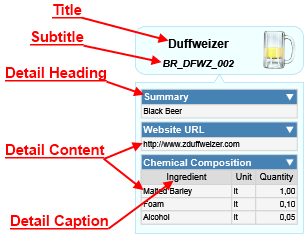

## Output Templates

Output Templates generate text files from compositions, concepts, and relationships. They use Liquid-style markup plus ThinkComposer control markup and helper filters.

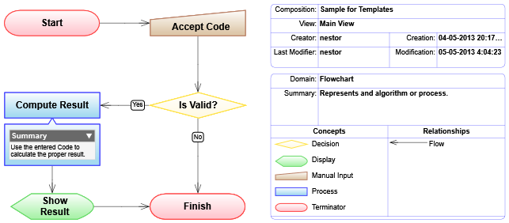

Domains can define:

- composition-level templates
- base concept templates
- base relationship templates
- definition-specific templates
- templates per external language
- subtemplates for reusable fragments

Current output-template behavior is described in [Current Features](04-current-features.md) and [Template Language](05-template-language.md).

## Concept And Relationship Definitions

Concept Definitions describe concept types. Relationship Definitions describe relationship types, directionality, central-symbol behavior, and role definitions.

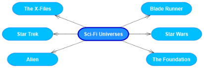

Relationship Definitions may hide their central symbol when simple, show a name label when hidden, and restrict valid source/target definitions through role compatibility.

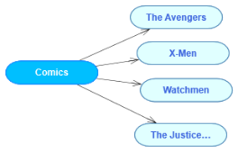

## Marker Definitions, Table Structures, And Base Tables

Marker Definitions define the icons and descriptors available for marking ideas.

Table Structure Definitions define reusable table schemas. Base Tables store domain-level reference data, such as units, states, options, or other lookup records used by templates and details.

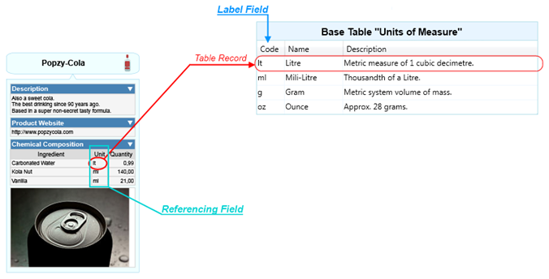

## External Languages

External Languages identify output targets such as XML, JSON, Markdown, code, Mermaid, or other text languages. Output templates are grouped by external language so the same model can generate different kinds of output.
