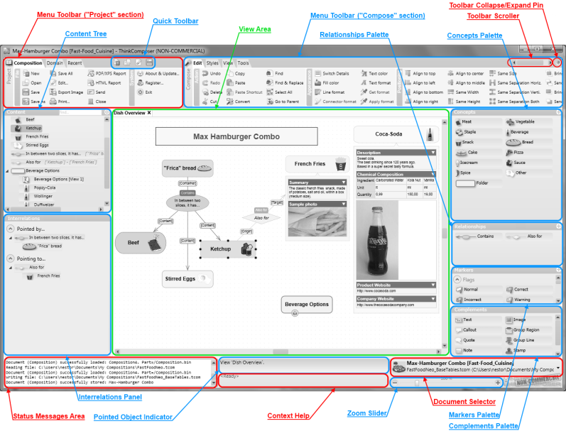
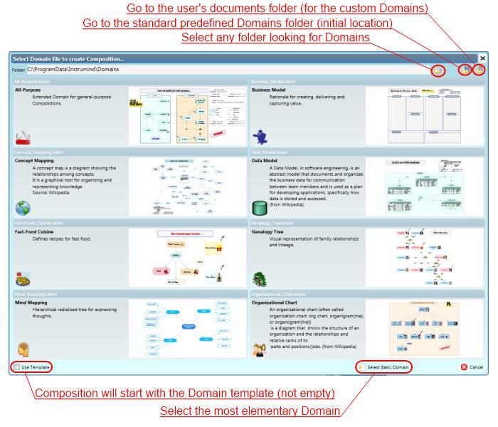
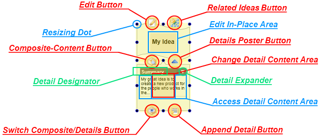
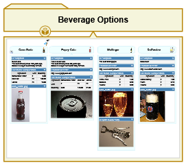
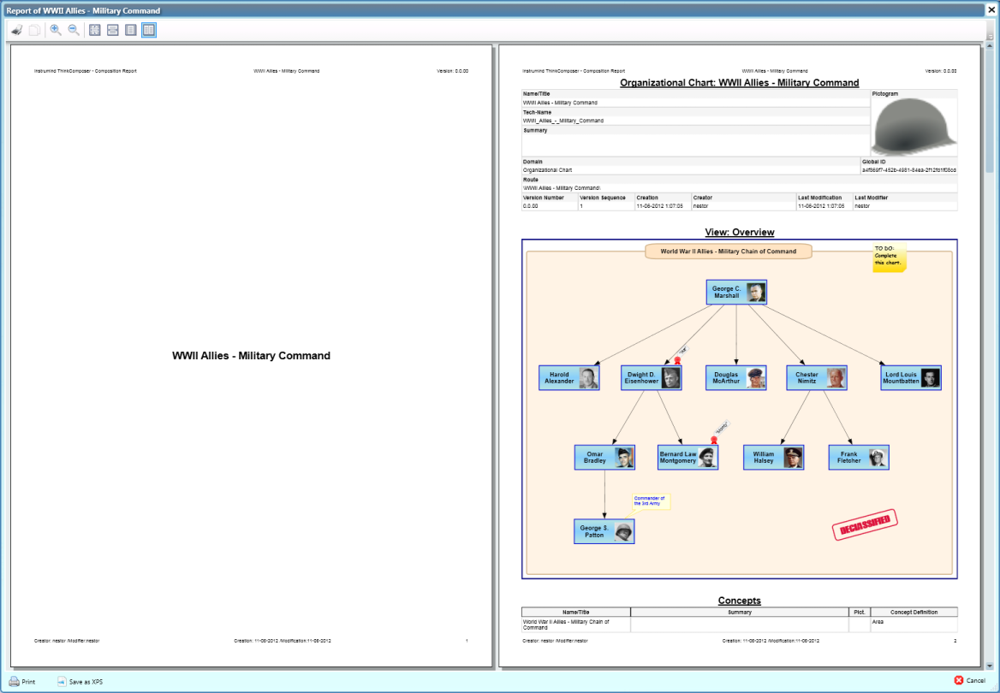

# Application Guide

This guide covers day-to-day use of ThinkComposer: setup, the main window, editing diagrams, working with composition content, and producing reports.

## Setup

### Requirements

ThinkComposer is a Windows desktop application. It is designed for modern desktop PCs and advanced laptops with enough screen area for visual modeling. It uses Windows Presentation Foundation for high-definition diagram rendering.

### Install And Uninstall

Install ThinkComposer through the provided installer. The installer includes the application, predefined domains, runtime assets, and the local PDF manual artifact used by older releases.

Use Windows application management or the installed uninstaller to remove the product.

### Version Update

The release notes in this repository identify the current maintained fork build as `1.5.1619`. Older manuals may still show document version `1.5.13.1127`; this Markdown manual is the maintained source intended to replace that static PDF.

Before updating a production installation, save or copy important `.tcom` and `.tdom` files.

### License Activation

Legacy builds include license activation behavior. Follow the installed application prompts for activation, trial control, or license updates.

## Main Window

The main window presents the active project, a menu toolbar, palettes, a diagram workspace, properties, and application messages.

Important areas include:

| Area | Purpose |
|---|---|
| Menu Toolbar | Global project commands and composition editing commands. |
| Project controls | Open, save, import, export, report, and domain-related commands. |
| Compose controls | Editing commands for concepts, relationships, details, appearance, and view behavior. |
| Palettes | Available concept definitions, relationship definitions, markers, and other domain objects. |
| Workspace | The active diagram view. |
| Status/log area | Operational messages, import/export diagnostics, and warnings. |

Current import, layout, and output-generation commands log detailed diagnostics to the lower-left application log. Dialogs intentionally stay concise.

## Working With Compositions

Create a composition when you need a new knowledge document. Choose an appropriate domain at creation time. The domain determines what concept and relationship definitions are available, how symbols look, and what details or templates can be used.

Save the native `.tcom` file as the source of truth. Exported JSON, reports, PDFs, images, and generated files are exchange or publication artifacts.

## Working With Diagram Views

A diagram view presents the composite content of the composition or a composite idea. You can open nested views, show composite content as details, and use shortcuts to show the same semantic idea in more than one place.

## Editing Symbols

Symbols can be selected, moved, resized, formatted, sent forward/backward, and connected. Many symbol behaviors are inherited from the domain definition, but individual visuals can still be manually arranged.

Use the Appearance commands for larger cleanup:

- `Fit Concept Width to Text`
- `Route Links with Obstacle Avoidance`
- `Arrange as Spider Map`
- `Arrange as Hierarchy Map`
- `Arrange as Flowchart`
- `Arrange as System Map`

These commands are covered in [Current Features](04-current-features.md).

## Creating Concepts

Create concepts by using the concept palette, context menus, shortcuts, or automatic creation behavior defined by the domain.

When a concept is created:

1. Its Concept Definition supplies the semantic type.
2. The domain supplies visual defaults.
3. The active view receives a visual representation unless creation is model-only.
4. Details, custom fields, markers, and composite behavior become available according to the definition.

## Creating Relationships

Create relationships by choosing a relationship definition and connecting concepts through the allowed roles. For directional relationships, ThinkComposer distinguishes origin/source and target/destination roles.

Relationship compatibility depends on the active domain. If a relationship definition restricts allowed endpoint definitions, invalid links are rejected or reported during import.

## Extending Or Modifying Relationships

Relationships can be extended by adding or adjusting role-based links when the relationship definition allows it. Link descriptors and role variants can annotate a connector without changing the relationship's own name or summary.

For generated or JSON-imported diagrams, prefer endpoint-corridor relationship placement so visible relationship centers stay near the concepts they connect.

## Converting Ideas

When domain rules allow it, ideas can be converted or redefined so the model remains meaningful while the visual organization evolves.

Use conversion carefully in mature compositions because templates, relationship compatibility, details, and domain-specific semantics may depend on definitions.

## Assigning Markers

Markers communicate status, priority, classification, or other domain-specific annotations.

Assign markers through the marker palette or context commands. Marker visibility can be controlled at the view level.

## Creating Complements

Complements add visual context around ideas and views. Use them for explanatory notes, callouts, images, legends, info-cards, and grouping boundaries.

Group Regions are especially useful for system boundaries, subgroups, and visual containers. Current System Map layout can create or update a visible Group Region around detected internal components.

## Creating Shortcuts

Use **Replace with Shortcut...** on a non-shortcut concept symbol when you want the selected visual to point to an existing idea instead of representing its original idea. On a shortcut symbol, use **Go to Original** to navigate to a primary visual representation.

Shortcuts preserve one semantic identity across multiple views or locations.

## Selection, Pan, And Zoom

Use selection to scope editing and layout commands. Many current Appearance commands operate on selected concept symbols or selected connectors when available, and otherwise prompt before acting on all visible objects.

Pan and zoom are view navigation tools only. They do not change the model.

## Reporting

ThinkComposer can generate reports from a composition and export views as images or PDFs.

Composition reports are publication artifacts. The `.tcom` file remains the authoritative source.

For more controlled text or code output, use Output Templates through `Tools -> Output -> Generation Preview` and `Tools -> Output -> Generate Files...`.
