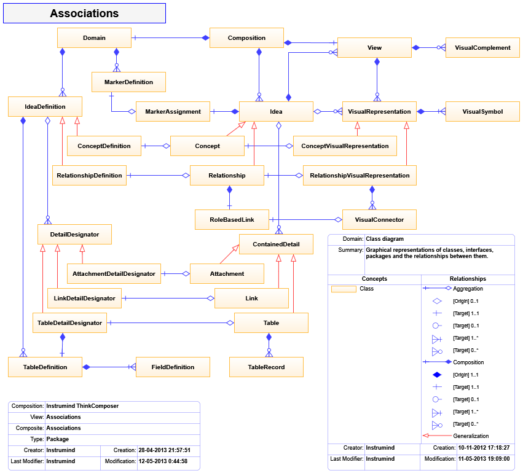
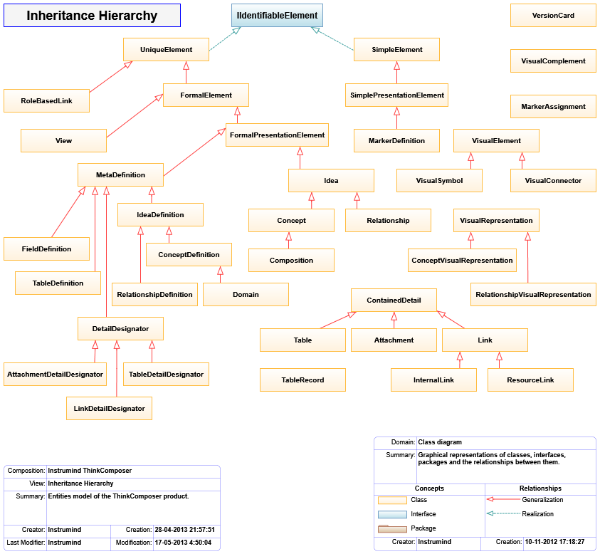

# Appendix B: Composition Information Model

This appendix summarizes the information model exposed to Output Templates. Templates use this model to read composition, idea, domain, detail, table, and visual information.





## Special Access Patterns

Use these access patterns when a template needs dynamic fields, details, table rows, or domain base tables.

**Custom Fields**

- Access: `_['<CustomFieldTechName>']`
- Example: `{{ _['Alias'] }}`

**Details**

- Access: `This['<DetailTechName>']`
- Example: `{{ This['MyTable'].Records.Size }}`

**Table Records**

- Access: `Record.FieldTechName` or `Record['FieldTechName']`
- Example: `{{ Person.Name }}; {{ Person['Age'] }}`

**Domain Base Tables**

- Access: `<Domain>.BaseContentRoot['<BaseTableTechName>']`
- Example: `{{ OwnerComposition.CompositionDefinitor.BaseContentRoot['States'].Records.Size }}`

Example:

```liquid
The {{ This['People'].Records.Size }} persons are:

Name: {{ Person.Name }}; Age: {{ Person['Age'] }}

```

## Core Classes

The model classes below are written as compact entries instead of a wide table so long class names and ancestors remain readable in the generated PDF.

**`Attachment`**

- Ancestor: `ContainedDetail`
- Summary: Embedded object from an external source, such as an image or file.

**`AttachmentDetailDesignator`**

- Ancestor: `DetailDesignator`
- Summary: Associates an attachment definition to an idea.

**`Composition`**

- Ancestor: `Concept`
- Summary: Semantic, informational, and visual set of ideas expressing knowledge about a subject.

**`Concept`**

- Ancestor: `Idea`
- Summary: Concrete object that can be associated to others through relationships.

**`ConceptDefinition`**

- Ancestor: `IdeaDefinition`
- Summary: Definition of a concept type.

**`ConceptVisualRepresentation`**

- Ancestor: `VisualRepresentation`
- Summary: Visual representation of a concept.

**`ContainedDetail`**

- Ancestor: none
- Summary: Object stored as detail for an idea.

**`DetailDesignator`**

- Ancestor: `MetaDefinition`
- Summary: Base ancestor for detailed-data designators.

**`Domain`**

- Ancestor: `ConceptDefinition`
- Summary: Metamodel for graph, visual, and information structures.

**`FieldDefinition`**

- Ancestor: `MetaDefinition`
- Summary: Defines a table field.

**`FormalElement`**

- Ancestor: `UniqueElement`
- Summary: Standard object with name, TechName, summary, TechSpec, rich description, and version.

**`FormalPresentationElement`**

- Ancestor: `FormalElement`
- Summary: Standard object with visual representation.

**`Idea`**

- Ancestor: `FormalPresentationElement`
- Summary: Base composition element from which concepts and relationships descend.

**`IdeaDefinition`**

- Ancestor: `MetaDefinition`
- Summary: Shared ancestor for concept and relationship definitions.

**`InternalLink`**

- Ancestor: `Link`
- Summary: References an internal property.

**`Link`**

- Ancestor: `ContainedDetail`
- Summary: References an external or internal object.

**`LinkDetailDesignator`**

- Ancestor: `DetailDesignator`
- Summary: Associates a link definition to an idea.

**`LinkRoleDefinition`**

- Ancestor: `MetaDefinition`
- Summary: Defines a relationship link role.

**`MarkerAssignment`**

- Ancestor: none
- Summary: Assignment of a marker to an idea, optionally with descriptor.

**`MetaDefinition`**

- Ancestor: `FormalPresentationElement`
- Summary: Definition-level object used to create schema objects.

**`ModelDefinition`**

- Ancestor: none
- Summary: Base classifier/member definition.

**`Relationship`**

- Ancestor: `Idea`
- Summary: Association between ideas through role-based links.

**`RelationshipDefinition`**

- Ancestor: `IdeaDefinition`
- Summary: Definition of a relationship type.

**`RelationshipVisualRepresentation`**

- Ancestor: `VisualRepresentation`
- Summary: Visual representation of a relationship.

**`ResourceLink`**

- Ancestor: `Link`
- Summary: References a file, folder, web address, or other external resource.

**`RoleBasedLink`**

- Ancestor: `UniqueElement`
- Summary: Links a relationship to a related idea through a role definition.

**`SimpleElement`**

- Ancestor: none
- Summary: Basic object with name, TechName, summary, and TechSpec.

**`SimplePresentationElement`**

- Ancestor: `SimpleElement`
- Summary: Simple object with a visual representation.

**`Table`**

- Ancestor: `ContainedDetail`
- Summary: Structured detail containing records.

**`TableDefinition`**

- Ancestor: `MetaDefinition`
- Summary: Defines a table structure.

**`TableDetailDesignator`**

- Ancestor: `DetailDesignator`
- Summary: Associates table structures to an idea, definition, or field.

**`TableRecord`**

- Ancestor: none
- Summary: One structured record inside a table.

**`UniqueElement`**

- Ancestor: none
- Summary: Object with a global unique identifier.

**`VersionCard`**

- Ancestor: none
- Summary: Version-control information for versionable objects.

**`View`**

- Ancestor: `FormalElement`
- Summary: Visual representation of the composite content of a composition or idea.

**`VisualComplement`**

- Ancestor: `VisualObject`
- Summary: Visual object exposing attached information such as notes, callouts, legends, and info-cards.

**`VisualConnector`**

- Ancestor: `VisualElement`
- Summary: Visual connection between symbols.

**`VisualElement`**

- Ancestor: `VisualObject`
- Summary: Base ancestor for visual representators such as symbols and connectors.

**`VisualRepresentation`**

- Ancestor: `UniqueElement`
- Summary: Groups visual elements that represent an idea in a view.

**`VisualSymbol`**

- Ancestor: `VisualElement`
- Summary: Base ancestor for visual symbols.

## Common Properties

The following property groups use one entry per property to keep long generic types readable in the PDF.

### `FormalElement`

**`Description`**

- Type: `String`
- Summary: Rich detailed text.

**`Name`**

- Type: `String`
- Summary: User-facing title.

**`NameCaption`**

- Type: `String`
- Summary: Single-line display name.

**`Summary`**

- Type: `String`
- Summary: Short summary.

**`TechName`**

- Type: `String`
- Summary: Stable technical identifier.

**`TechSpec`**

- Type: `String`
- Summary: Technical text for scripts, templates, formulas, or generated output.

**`Version`**

- Type: `VersionCard`
- Summary: Version metadata.

### `Idea`

**`_`**

- Type: `TableRecord`
- Summary: Alias of the custom-fields record.

**`AssociatingLinks`**

- Type: `EditableList<RoleBasedLink>`
- Summary: Links associating this idea to relationships.

**`CompositeIdeas`**

- Type: `EditableList<Idea>`
- Summary: Child ideas when this idea is composite.

**`CompositeViews`**

- Type: `EditableList<View>`
- Summary: Views for contained child ideas.

**`Details`**

- Type: `EditableList<ContainedDetail>`
- Summary: Contained details.

**`IncomingLinks`**

- Type: `IEnumerable<RoleBasedLink>`
- Summary: Links targeting this idea.

**`OutgoingLinks`**

- Type: `IEnumerable<RoleBasedLink>`
- Summary: Links originating from this idea.

**`OwnerComposition`**

- Type: `Composition`
- Summary: Owning composition.

**`OwnerContainer`**

- Type: `Idea`
- Summary: Owning composite idea.

**`RelatedFrom`**

- Type: `IEnumerable<Idea>`
- Summary: Ideas pointing to this idea.

**`RelatingTo`**

- Type: `IEnumerable<Idea>`
- Summary: Ideas pointed to by this idea.

**`This`**

- Type: `Idea`
- Summary: Self reference supporting detail indexer access.

**`VisualRepresentators`**

- Type: `EditableList<VisualRepresentation>`
- Summary: Visual representations of this idea.

### `Composition`

**`ActiveView`**

- Type: `View`
- Summary: Active view.

**`CompositionDefinitor`**

- Type: `Domain`
- Summary: Domain definition used by the composition.

**`RootView`**

- Type: `View`
- Summary: Initial central view.

**`UsedDomains`**

- Type: `EditableList<Domain>`
- Summary: Domains used by the composition.

**`ViewsPrefix`**

- Type: `String`
- Summary: Prefix for related view names.

### `Domain`

**`BaseContentRoot`**

- Type: `Concept`
- Summary: Root for predefined base content such as base tables.

**`DefaultTableDef`**

- Type: `TableDefinition`
- Summary: Default table structure.

**`IdeaClusters`**

- Type: `EditableList<SimplePresentationElement>`
- Summary: Palette clusters for idea definitions.

**`LinkRoleVariants`**

- Type: `EditableList<SimplePresentationElement>`
- Summary: Predefined role variants such as multiplicities.

**`MarkerClusters`**

- Type: `EditableList<SimplePresentationElement>`
- Summary: Palette clusters for marker definitions.

**`OwnerComposition`**

- Type: `Composition`
- Summary: Composition owning this domain instance.

**`ViewBackgroundImage`**

- Type: `ImageSource`
- Summary: Initial background for views.

### `IdeaDefinition`

**`CanAutomaticallyCreateGroupedConcepts`**

- Type: `Boolean`
- Summary: Allows automatic grouped concept creation.

**`CanAutomaticallyCreateRelatedConcepts`**

- Type: `Boolean`
- Summary: Allows automatic related concept creation.

**`CanGroupIntersectingObjects`**

- Type: `Boolean`
- Summary: Allows grouping objects intersecting a symbol or group region.

**`CompositeContentDomain`**

- Type: `Domain`
- Summary: Domain governing composite content.

**`ConceptDefinitions`**

- Type: `EditableList<ConceptDefinition>`
- Summary: Child concept definitions.

**`CustomFieldsTableDef`**

- Type: `TableDefinition`
- Summary: Custom field structure.

**`DetailDesignators`**

- Type: `EditableList<DetailDesignator>`
- Summary: Declared detail designators.

**`HasGroupLine`**

- Type: `Boolean`
- Summary: Creates ideas with an appended Group Line.

**`HasGroupRegion`**

- Type: `Boolean`
- Summary: Creates ideas with an appended Group Region.

**`IsComposable`**

- Type: `Boolean`
- Summary: Allows ideas of this definition to contain others.

**`IsVersionable`**

- Type: `Boolean`
- Summary: Enables version metadata.

**`RelationshipDefinitions`**

- Type: `EditableList<RelationshipDefinition>`
- Summary: Child relationship definitions.

**`RepresentativeShape`**

- Type: `String`
- Summary: Shape used for visual symbols.

**`TableDefinitions`**

- Type: `EditableList<TableDefinition>`
- Summary: Declared table structures.

### `Relationship`

**`DescriptiveCaption`**

- Type: `String`
- Summary: Short text describing relationship links.

**`IsAutoReference`**

- Type: `Boolean`
- Summary: Indicates a relationship can link an idea to itself.

**`IsAutoReferenceExclusive`**

- Type: `Boolean`
- Summary: Indicates all links point from/to the same idea.

**`Links`**

- Type: `EditableList<RoleBasedLink>`
- Summary: Implemented links.

**`OriginIdeas`**

- Type: `IEnumerable<Idea>`
- Summary: Source/participant ideas.

**`OriginLinks`**

- Type: `IEnumerable<RoleBasedLink>`
- Summary: Source/participant links.

**`RelationshipDefinitor`**

- Type: `Assignment<RelationshipDefinition>`
- Summary: Relationship definition assignment.

**`TargetIdeas`**

- Type: `IEnumerable<Idea>`
- Summary: Target ideas.

**`TargetLinks`**

- Type: `IEnumerable<RoleBasedLink>`
- Summary: Target links.

### `RelationshipDefinition`

**`AncestorRelationshipDef`**

- Type: `RelationshipDefinition`
- Summary: Ancestor relationship definition.

**`HideCentralSymbolWhenSimple`**

- Type: `Boolean`
- Summary: Hides the central symbol for simple relationships.

**`IsDirectional`**

- Type: `Boolean`
- Summary: Indicates source-to-target semantics.

**`IsSimple`**

- Type: `Boolean`
- Summary: Allows one source and one target link.

**`OriginOrParticipantLinkRoleDef`**

- Type: `LinkRoleDefinition`
- Summary: Origin or participant role definition.

**`ShowNameIfHidingCentralSymbol`**

- Type: `Boolean`
- Summary: Shows the name when central symbol is hidden.

**`TargetLinkRoleDef`**

- Type: `LinkRoleDefinition`
- Summary: Target role definition.

### `Table`

**`Count`**

- Type: `Int32`
- Summary: Number of records.

**`Definition`**

- Type: `TableDefinition`
- Summary: Table structure definition.

**`Records`**

- Type: `EditableList<TableRecord>`
- Summary: Records in the table.

**`RecordsLabel`**

- Type: `String`
- Summary: Text representation of the first records.

### `View`

**`BackgroundImage`**

- Type: `ImageSource`
- Summary: View background image.

**`GridSize`**

- Type: `Double`
- Summary: Grid size from 2 to 20 pixels.

**`GridUsesLines`**

- Type: `Boolean`
- Summary: Uses line grid instead of points.

**`OwnerCompositeContainer`**

- Type: `Idea`
- Summary: Composite idea owning this view.

**`PageDisplayScale`**

- Type: `Int32`
- Summary: View page scale percentage.

**`ShowConceptDefinitionLabels`**

- Type: `Boolean`
- Summary: Shows concept definition labels.

**`ShowContextGrid`**

- Type: `Boolean`
- Summary: Shows the grid.

**`ShowIndicators`**

- Type: `Boolean`
- Summary: Shows indicators over ideas.

**`ShowMarkers`**

- Type: `Boolean`
- Summary: Shows markers.

**`SnapToGrid`**

- Type: `Boolean`
- Summary: Aligns object positioning to grid points.

**`ViewSize`**

- Type: `Size`
- Summary: View dimensions.

### `VisualRepresentation`

**`DisplayingView`**

- Type: `View`
- Summary: View showing this representation.

**`IsShortcut`**

- Type: `Boolean`
- Summary: Indicates the visual points to an idea outside the current container.

**`MainSymbol`**

- Type: `VisualSymbol`
- Summary: Primary symbol of the representation.

**`RepresentedIdea`**

- Type: `Idea`
- Summary: Represented idea.

### `VisualSymbol`

**`AreDetailsShown`**

- Type: `Boolean`
- Summary: Indicates whether details are visible.

**`BaseArea`**

- Type: `Rect`
- Summary: Symbol heading rectangle.

**`BaseCenter`**

- Type: `Point`
- Summary: Symbol center.

**`BaseHeight`**

- Type: `Double`
- Summary: Symbol body height.

**`BaseLeft`**

- Type: `Double`
- Summary: Symbol body left position.

**`BaseTop`**

- Type: `Double`
- Summary: Symbol body top position.

**`BaseWidth`**

- Type: `Double`
- Summary: Symbol body width.

**`Complements`**

- Type: `EditableList<VisualComplement>`
- Summary: Attached complements such as callouts.

**`DetailsArea`**

- Type: `Rect`
- Summary: Details poster area.

**`ShowCompositeContentAsDetails`**

- Type: `Boolean`
- Summary: Shows composite content in the details area.

**`TotalArea`**

- Type: `Rect`
- Summary: Symbol plus details poster area.

## Generic Collection Types

**`EditableList<ItemType>`**

- Summary: Ordered collection.
- Relevant property: `Count`.

**`EditableDictionary<KeyType, ValueType>`**

- Summary: Key-value collection.
- Relevant property: `Count`.

**`Assignment<KeyType, ValueType>`**

- Summary: References a local writable object or an external read-only object.
- Relevant properties: `IsLocal`, `Value`.

**`Ownership<GlobalType, LocalType>`**

- Summary: References global/shared or local/exclusive ownership.
- Relevant properties: `IsGlobal`, `Owner`.

**`StoreBox<ContentType>`**

- Summary: Stores content that requires conversion to and from disk format.
- Relevant property: `Value`.

`TableRecord` also exposes dynamic properties based on the Field Definitions created for its Table Definition. Use the special access patterns above when field names are easier to resolve by TechName.
